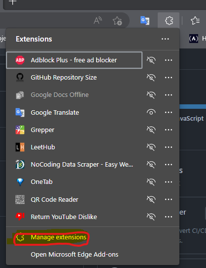
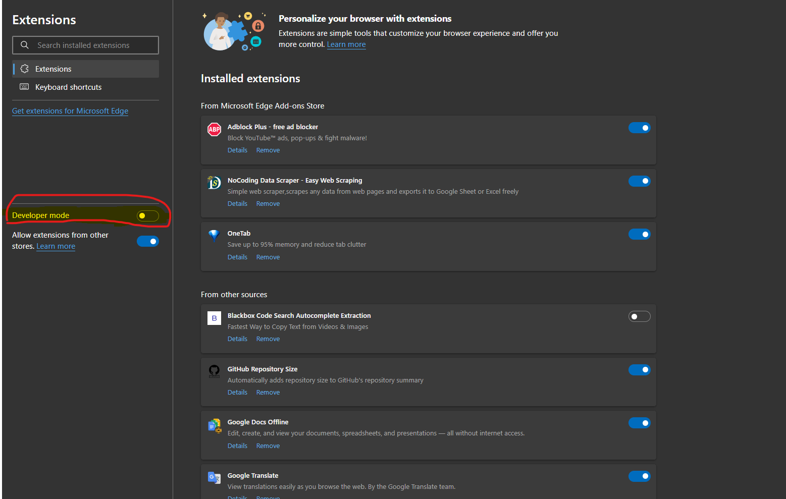
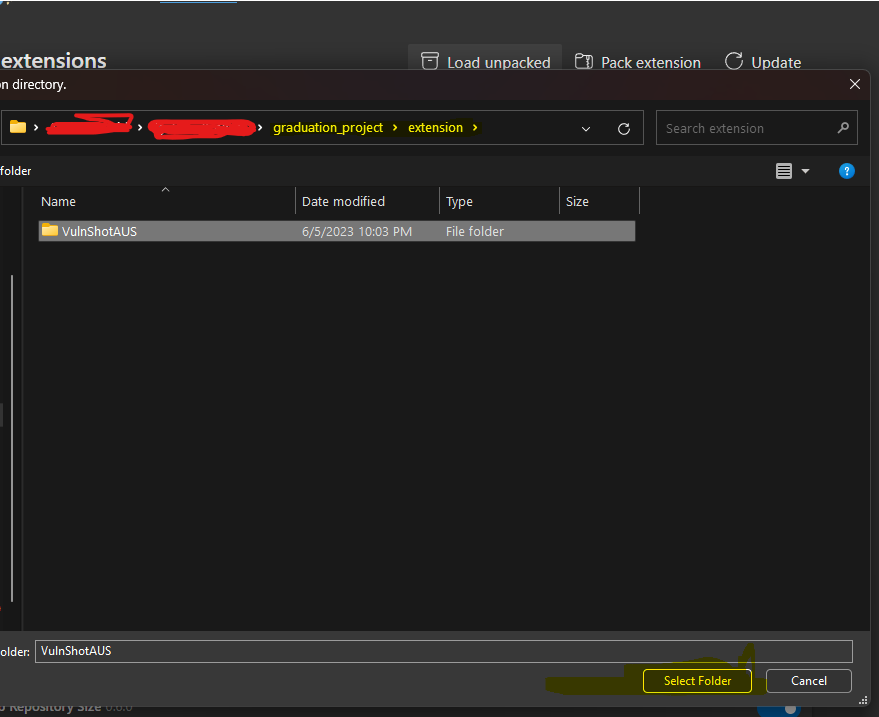
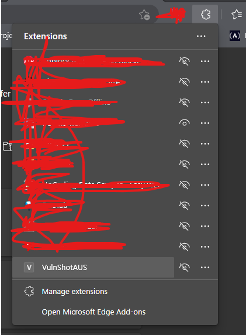

# SecurityForEver

## Introduction

- Sample Program that contains tools for `Recon` & `Exploitation` and more etc..

## Run

### Windows

- Open `git bash` terminal in your local. If not installed; Install it from [here](https://github.com/git-for-windows/git/releases/download/v2.41.0.windows.1/Git-2.41.0-64-bit.exe).

1. clone repo

    ```shell
    git clone https://github.com/Graduti0n-Pr0ject/pen-testing-Program.git
    cd pen-testing-Program
    ```
   
2. Install Installations file

    ```shell
    bash installation.sh
    ```

3. Run program

    ```shell
    python Main.py
    ```
### Install Extension

1. Open Extension


2. Check developer mode


3. Load extension from repo.


4. Choose folder extension [there](./extension/VulnShotAUS).


5. Finally open extension to see result and test it on any website

